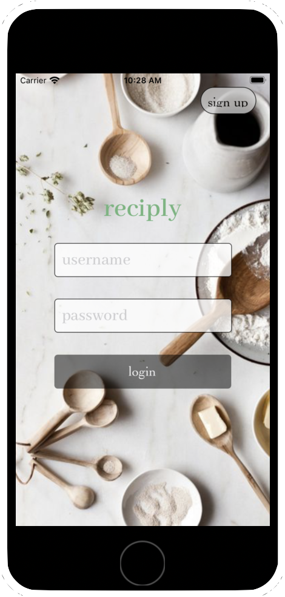
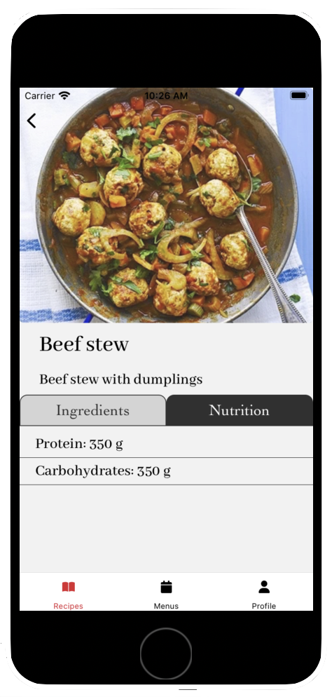
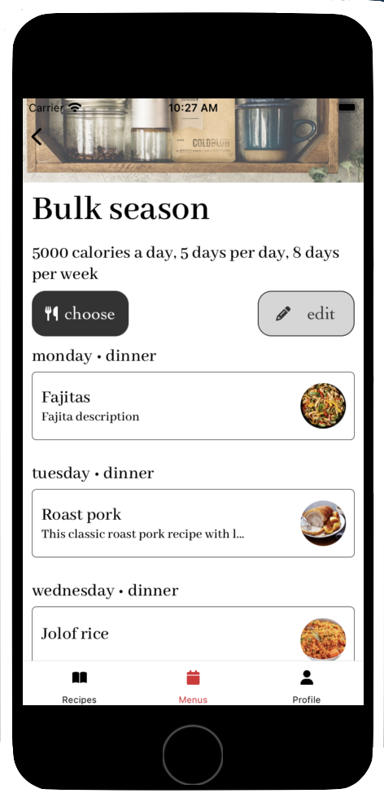

### Recipe & meal planning app implemented with React Native
Backend can be found [here](https://github.com/edwilson543/reciply-backend)

<div style="display: flex;">
    
    
    
</div>


### Setup

[React Native setup docs](https://reactnative.dev/docs/environment-setup)

#### System requirements
- node 18.16
- ruby >= 2.6.10
- cocoapods >= 1.12
- watchman


#### Installation
```bash
cd reciplyMobile
npm install
```

iOS:
```bash
cd reciplyMobile/ios
pod install
```

#### Run on iOS simulator
First, run the backend then:
```bash
npx react-native run-ios --simulator="iPhoneSE"
```
